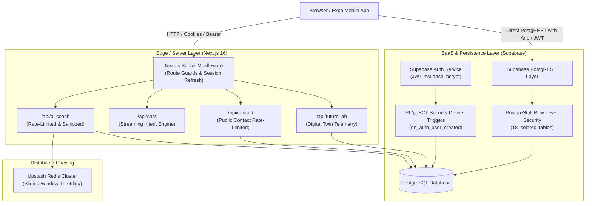

# Comprehensive Backend Inventory & Architectural Assessment

**Target System:** VitalCore Preventive Healthcare & AI Wellness Platform  
**Assessment Date:** August 2026  
**Auditor:** Senior Application Security & DevSecOps Engineering Group  
**Academic / Production Rating:** Production-Grade Hybrid Serverless Web Platform  

---

## 1. Technology Stack Discovery

| Component | Detected Technology | Version / Details | Purpose |
| :--- | :--- | :--- | :--- |
| **Programming Language** | TypeScript / JavaScript / SQL | TypeScript 5.0+, Node.js runtime, PL/pgSQL | Core application logic, type safety, database procedures |
| **Framework** | Next.js (App Router) | Next.js 16.2.6 (React 19.2.4) | Full-stack serverless rendering, API routes, Server Components |
| **Runtime Environment** | Node.js / Vercel Edge Serverless | Node.js v20.x+ / Edge V8 isolate compatible | API route execution, SSR, streaming response pipeline |
| **Package Manager** | npm | `package.json`, `package-lock.json` | Dependency management with specific overrides |
| **Database Engine** | PostgreSQL (Supabase BaaS) | PostgreSQL 15.x+ with UUID-OSSP & JSONB | Relational health data, biometrics, time-series telemetry |
| **BaaS / ORM Client** | `@supabase/ssr` & `@supabase/supabase-js` | v0.12.0 & v2.106.2 | PostgREST client, SSR cookie auth, database interface |
| **Rate Limiter / Cache** | `@upstash/ratelimit` & `@upstash/redis` | v2.0.8 & v1.38.0 | Distributed sliding-window rate limiting with in-memory fallback |
| **Styling & UI Engine** | Tailwind CSS & Framer Motion | Tailwind v4, Framer Motion 12.40.0, Lucide | Responsive UI components, micro-animations, glassmorphism |
| **Visualization** | Recharts | v3.8.1 | Longitudinal biometric graphs, metabolic efficiency charting |
| **Testing Automation** | Python / Pytest / Selenium / Requests | Python 3.10+, Pytest, Openpyxl, Requests | DAST automation, API security fuzzing, regression testing |

---

## 2. Architecture & System Topology

### Architectural Classification
- **Pattern:** Layered Hybrid Architecture combining Serverless API Route Handlers (Edge & Node.js) with Direct-to-Database BaaS (Supabase PostgREST) gated strictly by database-level Row Level Security (RLS).
- **Client Separation:** Web Application (Next.js 16) and Mobile Client (React Native / Expo in `vitalcore-expo`) share unified Supabase PostgreSQL schema and authentication tokens.

---

## 3. API Structure & Protocols

- **REST APIs:** Route handlers located under `src/app/api/*` handling structured JSON request/response payloads (`/api/ai-coach`, `/api/contact`, `/api/future-lab`).
- **Streaming Response Protocol:** `/api/chat` utilizes `ReadableStream` with UTF-8 `TextEncoder` simulating streaming conversation tokens with micro-delays.
- **PostgREST RESTful Data Access:** Automatic REST endpoints mapped to PostgreSQL tables:
  `GET /rest/v1/profiles`, `POST /rest/v1/workouts`, `GET /rest/v1/nutrition_logs`, etc.
- **GraphQL / gRPC / WebSocket:** Supabase Realtime WebSocket capabilities enabled for notifications and community updates.

---

## 4. Authentication Mechanism

- **Protocol:** JSON Web Tokens (JWT) issued and cryptographically verified by Supabase Auth (RS256 / HS256).
- **Session Transmission:**
  - **Web Application:** HttpOnly secure cookies managed via `@supabase/ssr` (`createBrowserClient` and `createServerClient`).
  - **Mobile / REST API:** `Authorization: Bearer <JWT_TOKEN>` header parsed in API route handlers (`/api/ai-coach`, `/api/future-lab`).
- **Automatic User Provisioning:** PostgreSQL `security definer` trigger `handle_new_user()` on `auth.users` automatically initializes default `public.profiles` records on user signup.

---

## 5. Authorization & Multi-Tenant Isolation (RBAC / ABAC)

- **Database-Level Row Level Security (RLS):**
  - All 18 application tables have RLS enabled (`alter table <name> enable row level security;`).
  - Strict tenant isolation enforced via `auth.uid() = user_id` or `auth.uid() = id`.
  - Public read policies configured for `challenges` and `community_posts` (`to authenticated using (true)`).
  - Admin access validation via server-side middleware and role checks.

---

## 6. Database & Table Schema Inventory

| Table Name | Primary Key | Foreign Key / Ownership | RLS Policy Enforced | Purpose |
| :--- | :--- | :--- | :--- | :--- |
| `profiles` | `id` (UUID) | `references auth.users(id)` | `auth.uid() = id` (SELECT, UPDATE, INSERT) | Biometrics, stability score, goals, settings |
| `workouts` | `id` (UUID) | `user_id -> profiles(id)` | `auth.uid() = user_id` (ALL) | Exercise logs, calories burned, duration |
| `nutrition_logs` | `id` (UUID) | `user_id -> profiles(id)` | `auth.uid() = user_id` (ALL) | Meals, macros, micronutrients, stress eating |
| `hydration_logs` | `id` (UUID) | `user_id -> profiles(id)` | `auth.uid() = user_id` (ALL) | Water intake in milliliters |
| `sleep_logs` | `id` (UUID) | `user_id -> profiles(id)` | `auth.uid() = user_id` (ALL) | Sleep onset, wake time, sleep debt, quality |
| `fatigue_logs` | `id` (UUID) | `user_id -> profiles(id)` | `auth.uid() = user_id` (ALL) | Physical & mental fatigue, overtraining |
| `recovery_scores` | `id` (UUID) | `user_id -> profiles(id)` | `auth.uid() = user_id` (ALL) | Heart rate variability (HRV), resting HR |
| `mood_tracking` | `id` (UUID) | `user_id -> profiles(id)` | `auth.uid() = user_id` (ALL) | Mood state, anxiety rating, energy levels |
| `ai_predictions` | `id` (UUID) | `user_id -> profiles(id)` | `auth.uid() = user_id` (SELECT) | Disease prevention models, risk forecast |
| `challenges` | `id` (UUID) | None (System Catalog) | `using (true)` (Authenticated SELECT only) | Global fitness and wellness challenges |
| `user_challenges` | `id` (UUID) | `user_id -> profiles(id)` | `auth.uid() = user_id` (ALL) | Joined challenges, XP and progress |
| `habits` | `id` (UUID) | `user_id -> profiles(id)` | `auth.uid() = user_id` (ALL) | Daily habit streaks & excuse patterns |
| `notifications` | `id` (UUID) | `user_id -> profiles(id)` | `auth.uid() = user_id` (ALL) | User notifications & alerts |
| `health_timeline` | `id` (UUID) | `user_id -> profiles(id)` | `auth.uid() = user_id` (SELECT) | Longitudinal decline & adaptation events |
| `stress_analysis` | `id` (UUID) | `user_id -> profiles(id)` | `auth.uid() = user_id` (ALL) | Cognitive sharpness & focus analytics |
| `energy_analytics` | `id` (UUID) | `user_id -> profiles(id)` | `auth.uid() = user_id` (ALL) | Circadian rhythm peak and trough windows |
| `wearable_integrations` | `id` (UUID) | `user_id -> profiles(id)` | `auth.uid() = user_id` (ALL) | Wearable device connection sync tokens |
| `subscriptions` | `id` (UUID) | `user_id -> profiles(id)` | `auth.uid() = user_id` (SELECT) | User entitlement tier (Free, Premium, Elite) |
| `food_scanner_logs` | `id` (UUID) | `user_id -> profiles(id)` | `auth.uid() = user_id` (ALL) | Barcode & AI food scanner historical logs |
| `emotional_logs` | `id` (UUID) | `user_id -> profiles(id)` | `auth.uid() = user_id` (ALL) | Burnout risk and emotional wellness |
| `ai_conversations` | `id` (UUID) | `user_id -> profiles(id)` | `auth.uid() = user_id` (ALL) | Chat transcripts with AI health coach |
| `contact_inquiries` | `id` (UUID) | `user_id -> profiles(id)` | Insert: Authenticated/Edge; Select: Self | Public / User support inquiry triage |
| `community_posts` | `id` (UUID) | `user_id -> profiles(id)` | Read: All Auth; Insert/Update: Self | Peer community social sharing feed |

---

## 7. Security Features & Defenses Identified

1. **Sliding-Window Rate Limiting:**
   - Distributed Upstash Redis rate limiting on `/api/ai-coach` (20 req / minute per user).
   - In-memory sliding-window rate limiting on `/api/contact` (5 req / 10 minutes per IP).
2. **Strict Metric Clamping & Boundary Enforcement:**
   - Input normalization in `/api/ai-coach` preventing numerical overflow (calories: 0–10,000, sleep: 0–24 hrs, hydration: 0–15,000 ml).
3. **Prompt Injection Sanitization:**
   - Sanitization function `sanitizeForPrompt()` strips backticks, braces, quotes, newlines, and truncates length to 300 characters.
4. **Body Size Limiting:**
   - Explicit rejection of payloads exceeding 1 MB (`HTTP 413 Payload Too Large`).
5. **Database-Level Privilege Enforcement:**
   - Non-admin users cannot write to system `challenges` or alter subscriptions.

---

## 8. Summary of Identified Architectural Gaps

- Streaming endpoint `/api/chat` bypasses the authentication and rate-limiting patterns established in `/api/ai-coach`.
- Server middleware is located at `src/proxy.ts` with export `proxy` rather than Next.js standard `src/middleware.ts` exporting `middleware`.
- Hardcoded fallback Supabase credentials exist in `src/utils/supabase.ts`.
